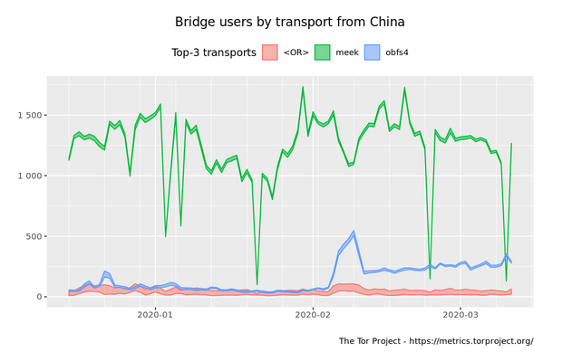

# Network Protocol Obfuscation for Grin

This document explores network protocol obfuscation challenges for Grin, particularly those resulting from a Tor-based default transaction method.

## Introduction/Background

Grin transactions currently require interactivity between a sender and receiver, creating additional security, censorship and usability challenges not present in other cryptocurrencies that do not require the same level of interactivity.

Since launch, Grin has relied on http(s) as the primary method to handle the interactive traffic exchange required by sender and receiver to complete Grin transactions. This method has poor censorship resistance as domains can be seized and TLS certificates can be revoked, poor privacy as the IP address of the counterparties are not protected, poor security unless TLS is required and poor usability as firewalls can prevent many users from being able to receive Grin.

Recently Grin has added support for Tor as a method to handle transaction interactivity traffic. This solves many of the above challenges with http(s) as a transaction method. Onion addresses are cryptographically generated with keys that cannot be arbitrarily seized. Tor also naturally helps protect the identity of users, though this is not a perfect guarantee of anonymity, it is much better than sharing an IP address. Usability is improved as Tor can punch firewalls to help make wallets accessible. Additionally the Tor method provides end-to-end encryption, similar to TLS, and is enforced- not optional. Finally Tor helps enable payment proofs which are essential for large scale adoption.

Given the benefits of using Tor for transactions in Grin and the risks and challenges of using http(s) it makes sense to consider using Tor as the default transaction method and deprecating http(s). This improves censorship resistance, prevents users from losing privacy by making opsec missteps attempting to use http(s) and encourages the adoption of more secure methods to transact.

## Problem

Tor is actively blocked in some regions and this could negatively impact Grin users located in those geographies if Tor is chosen as the default transaction method for Grin. Grin should ensure that users in those regions are able to continue to use Grin even if Tor is used as the default transaction method.

Additionally Grin should ensure that community services like exchanges and businesses in those regions have a robust alternative to Tor, because _even if Tor can be made technically censorhsip resistant, it may not become culturally censorship resistant_. This best alternative here, which already exists, is the file-based exchange method. If Tor is used as the default method and http(s) is deprecated, Grin should ensure the file-based method is robust, secure and usable. That is out of scope for this document but equally important.

It is also worth distinguishing between `grin` traffic between nodes and `grin-wallet` traffic between wallets. This document is primarily concerned with obfuscating traffing between wallets because the Tor transaction method as default may not work for users in regions where Tor is actively censored. Node traffic does not currently use Tor. In the future it may be a good idea to apply similar obfuscation techniques needed to bypass censorship of wallet traffic via Tor to all Grin traffic flows to improve privacy and censorship resistance.

## Possible Solutions

With Tor as the default transaction method for Grin and given that Tor is actively censored in regions with active Grin users, it is important for Grin to consider options to ensure that users in those regions can continue to easily use Grin with the default transaction method. Below we will explore three options for Grin to provide censorship resistance to a default Tor-based transaction method.

Note that while we have this problem because Tor is actively blocked in some regions, Grin itself could just as easily be blocked in those regions. For that reason simply not using Tor does not provide any true measure of censorship resistance. These methods may eventually be required for all Grin traffic if it becomes actively censored with DPI techniques.

As an example, Tor is actively blocked in China, a region with many Grin users. The below graph shows the obfuscation techniques used most recently to access Tor for users in China. Notice the correlation in activity between methods. This is likely due to packets becoming blocked for one technique so users must manually switch to the other to regain packet flow.

### Documentation + Community Provided Bridges

The least complex solution from a technical perspective (and most complex from a user perspective) is to provide documentation and bridge access for users to manually use existing network obfuscation techniques to access Tor. Tor provides this infrastructure already. Grin can reflect this in its documentation and provide its own supplemental method to maintain and distribute bridges outside of the Tor project.

This reduces the likelihood that users cannot access Tor at all and allows a high level of flexibility for the user as they can manually try to connect with any available pluggable transport method without adding high complexity and risky libraries to the Grin codebase.

### Native Obfs4 w/ Bridge Discovery/Sharing Mechanisim for grin-wallet

Another option is to bundle obfs4 support with `grin-wallet` including a bridge discovery/sharing mechanism. This will allow a `grin-wallet` that detects Tor connections failing to retrieve an obfs4 bridge to attempt to connect through. This process would be handled automatically for the user at the cost of increased codebase complexity. There is a fairly well supported [obfs4 implementation](https://github.com/Yawning/obfs4) but it is written in Go.

### Grin Nodes with Optional Obfs4 Bridge Flag

This takes the above native obfs4 `grin-wallet` option a step further. It would enable Grin nodes to act as obfs4 bridges themselves rather than relying on the Tor Project or Grin community to feed new bridges through the discovery mechanism. This comes at a cost of adding complexity to `grin` itself in addition to `grin-wallet`.

In addition to improved censorhsip resistance this option improves privacy. It makes Grin traffic harder to distinguish from other traffic using obfs4. This means Grin can blend in with the traffic of tens of thousands of Tor users at the cost of being censored if all obfs4 traffic is being blocked with DPI techniques.

Taken a step further, if all Grin network traffic were forced through obfs4, it would become impossible to distinguish Grin packets from other obfs4 packets like those destined for Tor. This would have a major privacy improvement for Grin traffic and users by extension at the cost of complexity of implementing and properly configuring obfs4 in the `grin` node.

### Final Thoughts

`Documentation + Community Provided Bridges` is probably the most attractive option. The best way for Grin to improve on the current censorship resistance techniques for Tor today is probably to provide the community a set of both obfs4 and meek bridges that are not listed with the Tor Project as well as clear documentation to properly use them. In the future a more viable network obfuscation protocol maybe become available that will make more sense to integrate for Grin's network flow than obfs4 which can be easily detected and blocked with DPI at the cost of a 0.2% false positive block rate.

The best option for now may be to retain flexibility for users actively censored to use whichever combination of technology will bypass their particular DPI filters, as this can vary region to region.

While this adds a further technical burden to the user, as long as the use of multiple obfuscation techniques are required to successfully avoid censorship over time, the improved UX of a native transport integration for Grin transactions doesn't appear worth the added complexity until a more robust network obfuscation protocol than obfs4 and meek is developed and tested.

## FAQ

* *Why isn't meek suggested as a native transport option for Grin?*

Domain fronting is challenging to implement for this use case and it requires DNS/SNI currently. This is more feasible if being done manually by the user as explained the first option of following documentation and using community-provided bridges.

* *Why obfs4? Doesn't GFW block that? Isn't it detectable?*

GFW *can* block obfs4 (and any other known obfuscation protocol) with DPI techniques at the cost of blocking some legitimate packets in the crossfire. Evidence seems to indicate that GFW most likely currently blocks obfs4 by scraping the lists of bridges provided by the Tor Project and blocking requests to those IPs. In some cases GFW will DPI and flag for potentially obfuscated Tor traffic flows. From there flow of the destination IP is analyzed for a Tor handshake and blocked. It is unknown to what extent this occurs. While meek is used by more Tor users in China, obfs4 maintains a consistent number of users as well so it is not completely blocked at the packet level.

Until Grin becomes actively censored by GFW, it is currently believed that private obfs4 bridges still work as censors must actively harvest IPs from Grin's own bridge distribution channel. If this were occuring you would likely also see regular Grin network traffic being blocked, which is much easier to block than obfs4 traffic. Additionally obfs4 provides the advantage of making Grin packets indistinguishable from other obfs4 uses, which currently serves tens of thousands of active users.

* *Are these really the only options? Why isn't all bitcoin traffic censored?*

Unfortunately, yes these are the known well-researched and publicly available implementations of network protocol obfuscation techniques. All cryptocurrency traffic could easily be censored using the same methods currently used to censor Tor traffic, including Bitcoin and Grin. Research in this area is critical and should be done before *any* blockchain packets are actively censored. If Tor traffic can be censored, so can Grin traffic.

## References

https://metrics.torproject.org/userstats-bridge-country.html

https://metrics.torproject.org/userstats-bridge-transport.html

https://trac.torproject.org/projects/tor/wiki/doc/AChildsGardenOfPluggableTransports

https://www.bamsoftware.com/papers/fronting/

https://trac.torproject.org/projects/tor/wiki/doc/meek

https://github.com/Yawning/obfs4

https://github.com/mimblewimble/grin-rfcs/blob/master/text/0010-online-transacting-via-tor.md
