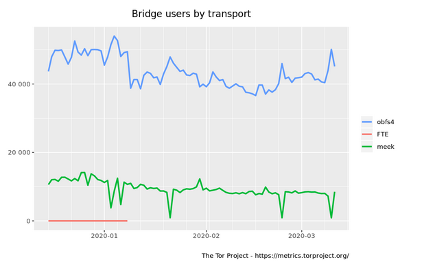

# Network Protocol Obfuscation Techniques

All known network obfuscation techniques can be detected and blocked with active attacks and enough traffic[0]. The overall effectiveness for each method is based on the theoretical difficulty to distinguish the "obfuscated traffic" from "normal traffic" and the practical detection and blocking of the "obfuscated traffic" flows in practice around the world.

## _Working_ Network Protocol Obfuscation Techniques

_These techniques have working, well-tested implementations with many users._

| Protocol | Approach | *TPR | *FPR | Effectiveness | Notes |
| --- | --- | --- | --- | --- | --- |
| [Obfs4](https://github.com/Yawning/obfs4/blob/master/doc/obfs4-spec.txt) | Randomizer | 100% | 0.2% | Medium | Detectable with simple heuristics (having no fingerprint is itself a fingerprint). Relatively high false positive rate may limit censorship with known DPI techniques. Most commonly censored today by harvesting publicly available bridge IPs from Tor Project. Tor users behind GFW using obfs4 bridges provided by the Tor Project may want to use meek or find a private obfs4 bridge. It is unknown to what extent GFW actively blocks obfs4 traffic from private IPs. |
| [Meek](https://www.bamsoftware.com/papers/fronting/) | Tunneling/Domain Fronting | 98% | 0.02% | Medium | Detectable with trained decision trees. Seems to have most success behind GFW. May have other privacy issues. |
| [FTE](https://kpdyer.com/publications/ccs2013-fte.pdf) | Mimicry | 100% | 0.003% | Low | Low/no use in Tor today, trivially detectable |

## _Research_ Network Protocol Obfuscation Techniques

_These techniques may or may not have working implementations. They require more time for assessment before being used with confidence._

| Protocol | Notes |
| --- | --- |
| [DNS-Morph](https://arxiv.org/abs/1904.01240) | Modification to obfs design to use DNS-based handshake |
| [Snowflake](https://trac.torproject.org/projects/tor/wiki/doc/Snowflake) | Uses temporary WebRTC proxies, similar to flash proxies but solves NAT problems |

## _Broken/Deprecated/Abandoned_ Network Protocol Obfuscation Techniques

_These techniques are completely broken, depcreated in favor of a newer protocol or abandoned. They are listed for research purposes._

| Protocol | Approach | *TPR | *FPR |
| --- | --- | --- | --- |
| [Obfs3](https://gitweb.torproject.org/pluggable-transports/obfsproxy.git/tree/doc/obfs3/obfs3-protocol-spec.txt) | Randomizer | 100% | 0.2% |
| [ScrambleSuit](http://www.cs.kau.se/philwint/scramblesuit/) | Randomizer | NA | NA |
| [Dust](https://github.com/blanu/Dust) | Randomizer | NA | NA |
| [SkypeMorph](http://cacr.uwaterloo.ca/techreports/2012/cacr2012-08.pdf) | Mimicry | NA | NA |
| [StegoTorus](https://github.com/TheTorProject/stegotorus) | Mimicry | NA | NA |

_* True-positive (TPR) and false-positive (FPR) rates of detection are based on data set from [0]_

[0] http://pages.cs.wisc.edu/~liangw/pub/ccsfp653-wangA.pdf
